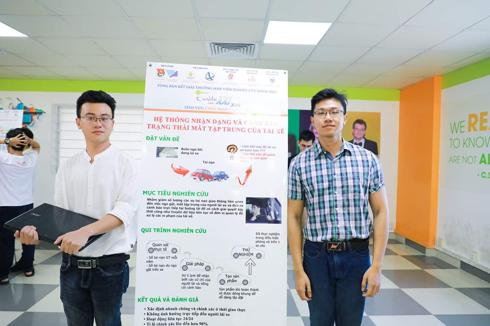
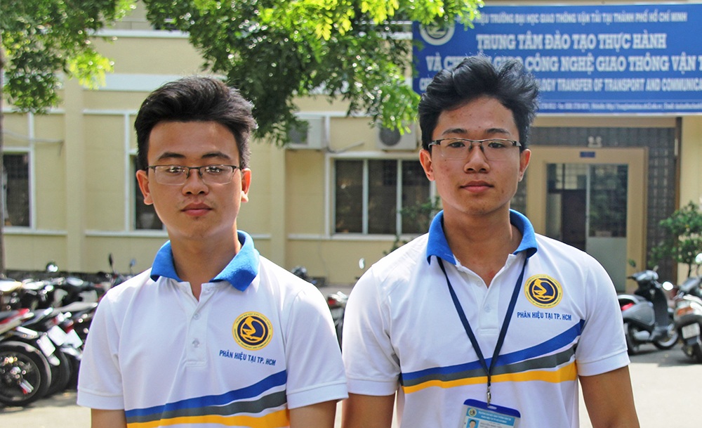
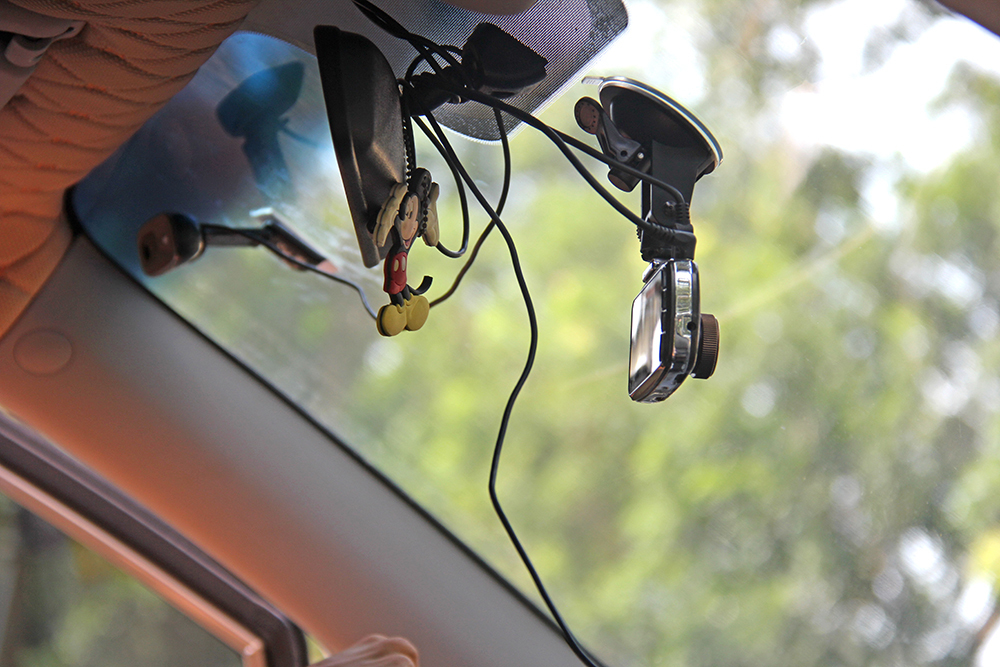
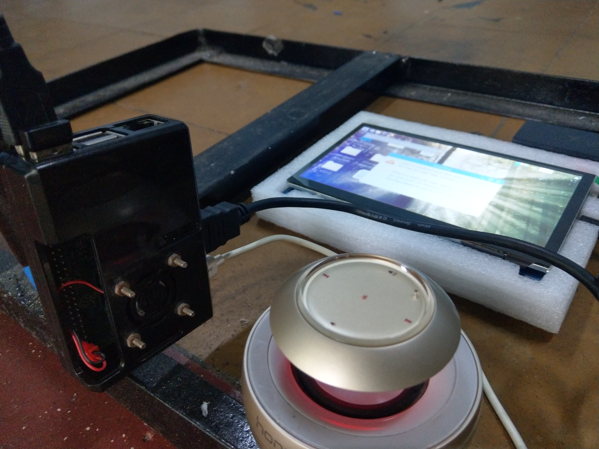
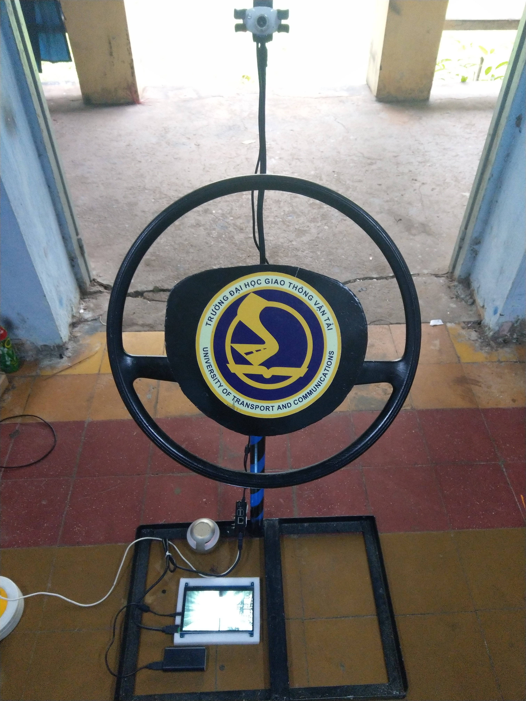
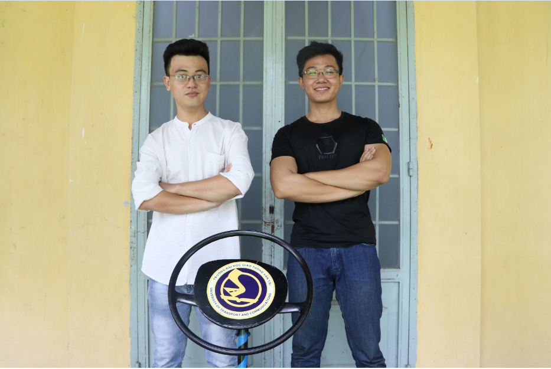

# Cảnh Báo Ngủ Gật - Giao Diện PyQT5

## Giới thiệu

- Đề tài nghiên cứu khoa học Đại học Giao thông vận tải - Phân hiệu tại TP.HCM

## Prerequires

### Hướng dẫn cài đặt PyQT5

- Windows: [Python GUI with PyQt5 - YouTube](https://www.youtube.com/watch?v=ksW59gYEl6Q)

- Linux:
  
  1. `pip3 install cmake`
  
  2. `pip3 install dlib`
  
  3. `sudo apt-get install qttools5-dev-tools`
  
  4. `sudo apt-get install pyqt5-dev-tools`

- MacOS:
  
  1. `pip3 install cmake`
  
  2. `pip3 install dlib`
  
  3. `pip3 install pyqt5`
  
  4. [Get Qt - Download now](https://www.qt.io/download)

### Compile dlib on Linux

- install compiler tool: `pip install cmake`

- compile library: `pip install dlib`

### Giải thuật
#### Mắt
```
if (eye_avr < __EYE_THRESH)
  enable a eye counter
  if (eye counter > __CONTINOUS_FRAME_EYE)
    // definitely buồn ngủ
else
  reset the counter when eye_avr is larger than __EYE_THRESH
```
#### Miệng
```
if (mouth_avr < __MOUTH_THRESH)
  enable a mouth counter
  if (mouth counter > __CONTINOUS_FRAME_MOUTH)
    // definitely ngáp
else
  reset the counter when mouth_avr is larger than __MOUTH_THRESH
```
## Thư viện hình ảnh và video

### Hình ảnh

</img>
</img>
</img>
</img>
</img>
</img>
</img>
</img>

### Video

#### Giới thiệu

[](http://www.youtube.com/watch?v=6vOgE5Ps3GM "intro 2019")

#### Báo chí truyền thông 
1. [Trung tâm Tin tức VTV24 | Sinh viên chế tạo hệ thống cảnh báo ngủ gật cho lái xe](https://www.facebook.com/223790994475363/videos/932651280460774)
2. [vnExpress | Sinh viên TP HCM chế tạo hệ thống cảnh báo ngủ gật trên ôtô](https://video.vnexpress.net/tin-tuc/cuoc-song-4-0/sinh-vien-tp-hcm-che-tao-he-thong-canh-bao-ngu-gat-tren-oto-3967151.html)
3. [ThanhNien | Sinh viên chế tạo hệ thống cảnh báo ngủ gật trên xe ô tô](https://thanhnien.vn/video/phong-su/sinh-vien-che-tao-he-thong-canh-bao-ngu-gat-tren-xe-o-to-154921v.html)
4. [GiaoThong | Sinh viên chế tạo camera chống lái xe ngủ gật](https://www.baogiaothong.vn/sinh-vien-che-tao-camera-chong-lai-xe-ngu-gat-d434832.html)

## Nhóm đóng góp



- Nguyễn Minh Tiến - [Facebook](https://www.facebook.com/spiderock98) | [Telegram](https://t.me/spiderock98) | [Instagram](https://www.instagram.com/spiderock98/) | [YouTube](https://www.youtube.com/channel/UCKtd98ra9ovo2HW4_UFC9Cw/videos)
- Lê Trung Phương - [Facebook](https://www.facebook.com/le.phuong.ltp)
- GVHD: Võ Thiện Lĩnh - [Facebook](https://www.facebook.com/MR.DUACHUOT)